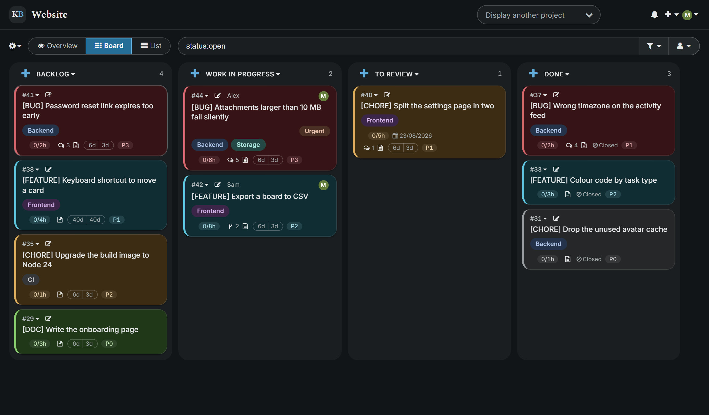
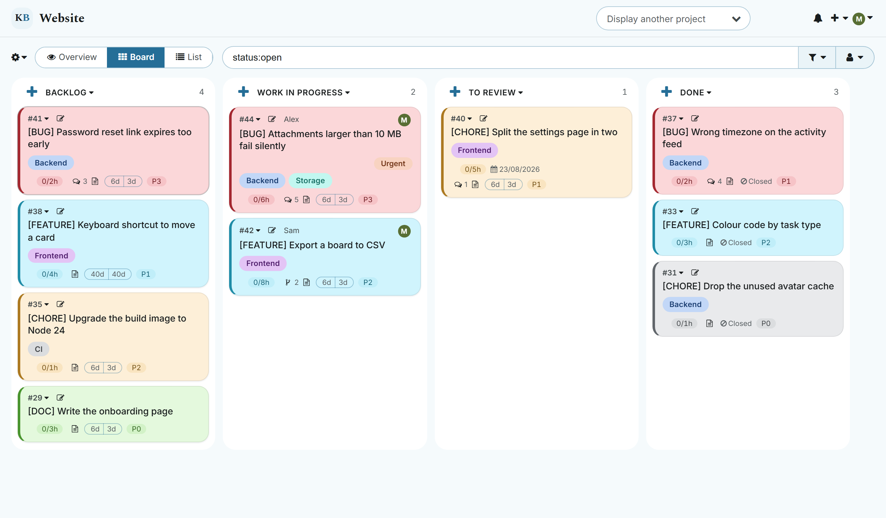
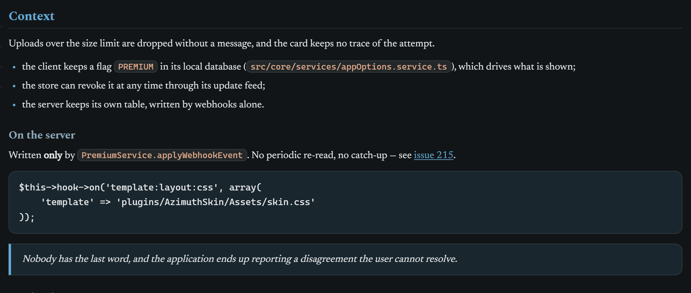
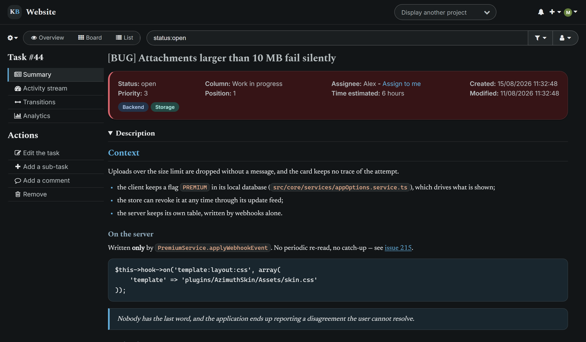

# AzimuthSkin

A calm, high-contrast skin for Kanboard — for **both** themes, not just the dark one.

Kanboard's dark theme paints task tags in `#a0a0a0` on the pastel card background inherited from
the light theme: about **1.8:1**. The card title, on that same pastel, is forced to `#000`. So a
card mixes hard black with washed-out grey, and the tag — the thing that tells you which part of
the product a task belongs to — is the least readable text on the board.

This skin fixes that, and takes the rest of the interface with it.





## What changes

**Card colours become information again.** The type colour stays, but it is no longer what the
text is written on: the fill becomes a deep tint in dark and keeps the familiar pastel in light,
and the saturated hue moves to a bar on the leading edge, where it reads at a glance without
dragging the contrast of everything printed on top. Tags become pills carrying their own fill and
their own ink.

The sixteen fills are also checked against **each other**, not only against their text. Red and
orange started life 7.5 apart in CIEDE2000 — each perfectly legible, and indistinguishable from
one another on a board. They are 16.7 apart now.

**Task text gets a typographic scale.** Kanboard styles its markdown block in nine declarations,
all of them spacing: no scale between a heading and a paragraph, inline code no different from
prose, and a `pre` painted `#fbfbfb` with a `#ddd` border — invisible in the light theme, glaring
in the dark one.



**The toolbar stays on screen.** On every project view, the application header and the project
toolbar hold still while the content scrolls under them — and the scrollbar starts *below* the
toolbar rather than beside it. Views with two panes (a task, a project's settings) go further:
the shell does not move at all and each pane scrolls on its own, so the action menu stays under
the hand.



**Scrollbars are quiet.** Thin, inset by a transparent border so the thumb keeps a comfortable hit
area while looking like a hairline, and stable enough not to shift the content sideways when they
appear.

The skin **does not touch the meaning** of Kanboard's colours: a red task stays red, a blue tag
stays blue. Only their shape and their contrast change.

## Accessibility

Every colour pair the stylesheet paints on top of another is measured, not eyeballed:

```
node contrast.mjs
```

It reads the tokens straight out of the two stylesheets and checks body text on the three
surfaces, the card footers on each of the sixteen fills, each tag pill's ink on its own chip, and
each identifying bar against the card it edges. **4.5:1** for text, **3:1** for the bars — they
carry meaning, they are not ornaments. It exits non-zero on the first pair below the line, so it
can gate a change to a colour.

It then answers a second question contrast cannot: do two cards sitting side by side tell
themselves apart? The sixteen fills are compared in **CIEDE2000**.

Beyond the tokens, the skin was run through **axe-core** (`wcag2a`, `wcag2aa`, `wcag21a`,
`wcag21aa`) on static replicas of the board, the task view, the list, the project overview and a
form, in both themes: **zero** `color-contrast` violations.

Two families of violations remain, and **neither belongs to a stylesheet** — they are Kanboard
template defects: icon-only links with no accessible name (`link-name`), and the selection
checkboxes in the list view with no label (`label`).

## Install

**From the plugin manager** — Settings → Plugins, once the plugin is listed in the directory.

**From a release** — download `AzimuthSkin-<version>.zip` from the
[releases](https://github.com/MatthieuFereyre/AzimuthSkin/releases) and unzip it into your
`plugins/` directory.

**From source**

```bash
cd /path/to/kanboard/plugins
git clone https://github.com/MatthieuFereyre/AzimuthSkin.git AzimuthSkin
```

Reload the page. There is nothing to restart and nothing to configure: Kanboard reads its plugin
folder on every request, and stamps its stylesheets with their `filemtime`, so the browser cache
invalidates itself.

Both themes are supported. Pick yours in your profile, as usual.

## Compatibility

Kanboard **1.2.29** and later — that is the release that added theme support, which the dark
palette and the profile lookup that picks it both depend on. Developed and verified against
**1.2.53**.

`:has()` is used to know which page is open without touching a template. Where it is missing
(Chrome and Edge before 105, Safari before 15.4, Firefox before 121), the scrolling rules are
dropped and the page scrolls as it did before — everything else applies normally.

## How it works

Kanboard drives its two themes **entirely from custom properties** declared on `:root`: the same
97 names in `light.min.css` and in `dark.min.css`, only the values differ. Redeclaring those 97
properties carries the tables, the menus, the alerts and the fields along without naming any of
them. What custom properties cannot reach is overridden by name at the end of the sheet: about
forty colours Kanboard writes literally, and the sixteen task colours it prints in an inline
`<style>` in the head.

| File | Role |
|---|---|
| `Assets/skin.css` | the whole design, plus the light palette |
| `Assets/theme-dark.css` | the dark palette, tokens only |
| `Assets/skin.js` | one thing only: gives the project overview a single element to scroll |
| `Template/layout/head.php` | adds the dark palette when the profile asks for it |
| `contrast.mjs` | the contrast guard |

**Nothing in the served HTML says which theme is active** — light and dark differ by the href of
one stylesheet and by nothing else, so plain CSS cannot branch on it. Hence the template hook:
`template:layout:head` is rendered by a template, the only place where the user's theme can be
read. If it ever stops firing, the light palette still applies and the interface stays legible
rather than collapsing.

## Other plugins

A plugin can ship a stylesheet of its own, and Kanboard attaches them all to the same hook in
alphabetical order — so a plugin whose name sorts after this one wins any token they both declare.

**PluginManager** does exactly that: its palette is written for a light interface, and under the
dark theme its sidebar sat at 2.2:1, its table headers at 1.3:1 and the text in its panels at
1.06:1. It also reassigns `--color-light`, one of Kanboard's own tokens, without using it
anywhere — a reassignment that reaches the whole application, not just its pages.

The last section of `skin.css` maps its tokens onto the theme's, and puts `--color-light` back.
Both are measured on a replica of its screens, along with everything else.

## Fonts

Inter, Spectral and Newsreader are bundled and served by your own instance — **no request leaves
for Google Fonts**. Each is subset to Latin. All three are under the SIL Open Font License 1.1,
whose text and the three copyright notices are in `Assets/fonts/OFL.txt`.

## Licence

MIT — see [LICENSE](LICENSE). The bundled fonts keep their own licence, above.
